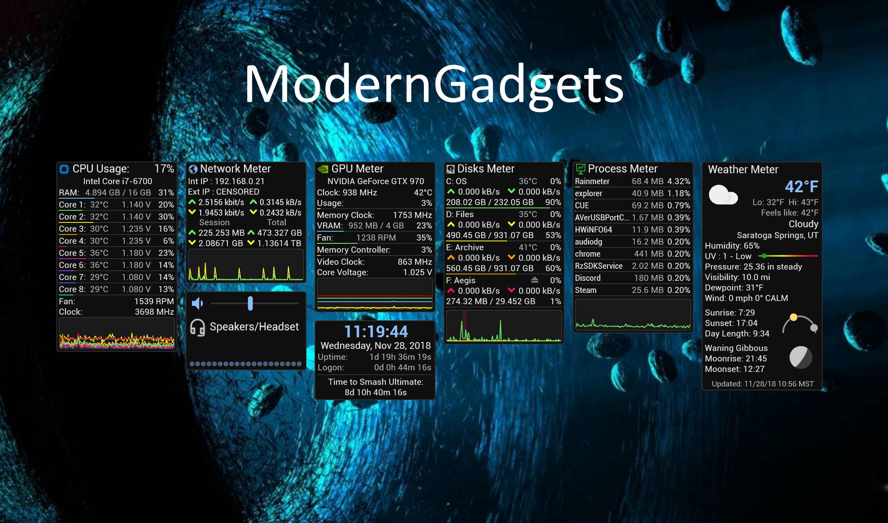

ModernGadgets is a set of sleek, minimalist, information-dense gadgets that are designed to fit right into your modern desktop. It is inspired by the AddGadgets.com system monitoring gadgets and is heavily based on [SilverAzide's Gadget Replicas](https://www.deviantart.com/silverazide/art/Gadgets-4-1-1-522574269).

ModernGadgets is released on the Rainmeter platform under a Creative Commons Attribution-NonCommercial-ShareAlike 3.0 license. The source code is made available on GitHub under an MIT License.

## Requirements
Rainmeter 4.3 or newer: https://www.rainmeter.net

HWiNFO: https://www.hwinfo.com

.NET Framework 4.5 or newer

Alternatively, CPU Meter supports [CoreTemp](https://www.alcpu.com/CoreTemp/) or [SpeedFan](http://www.almico.com/speedfan.php) for CPU core temperatures and some other information.

## Installation Instructions
ModernGadgets official releases are packaged using the Rainmeter skin installer. After downloading the .RMSKIN package, make sure you have Rainmeter installed, then simply open the file to install the suite. It is recommended that you load the included layout if it is your first time installing. If you are updating from a prior version, you do not need to load the layout.

## Code of Conduct
### Bug Reports
First and foremost, please read through the setup tutorial. You may find that something you thought was broken just needs to be configured properly (e.g. HWiNFO not communicating with Rainmeter). If the problem is not addressed in the setup tutorial, please SEARCH FOR the issue under the issues section of the repository. If the issue has not already been reported, feel free to make a new one. Be clear and use proper language both in the title and the description of any issues you create.

### Contributions
Contributions are welcome! If you would like to add your own code, feel free to fork the repository and submit a pull request when ready. A list of things to be done will be kept in the issues section of the repository.

### Suggestions
Rather than giving ideas or suggestions, please try to implement the functionality yourself. Rainmeter is a very open and community-centric platform, and it's fairly easy to learn, so dig in! The [Rainmeter Forums](https://forum.rainmeter.net) and [Rainmeter Documentation](https://docs.rainmeter.net) are good places to get started and recieve assistance.

## Credits
Designed and programmed by Caleb Heuer (raiguard).

Backend code based on "Gadgets" by SilverAzide.

"IBM Plex Sans" font from Google Fonts, under the Apache 2.0 License

"Material Icons" font from Google, under the Apache 2.0 License.

"Elegant Icons" font from Elegant Themes, under GPL and MIT Licenses.

"Google Now Weather Feed Icons" from NCrystal on DeviantArt.

### Additional Attributions
SilverAzide - ActiveNet plugin, NetMonitor utility, fixed precision format script

stangowner - HWiNFO Plugin, HWiNFO Shared Memory Viewer

jsmorley - RainRGB, Rainmeter

balala - Help with fixing Disks Meter's dynamic height adjustment

smurfier - ReadINI function