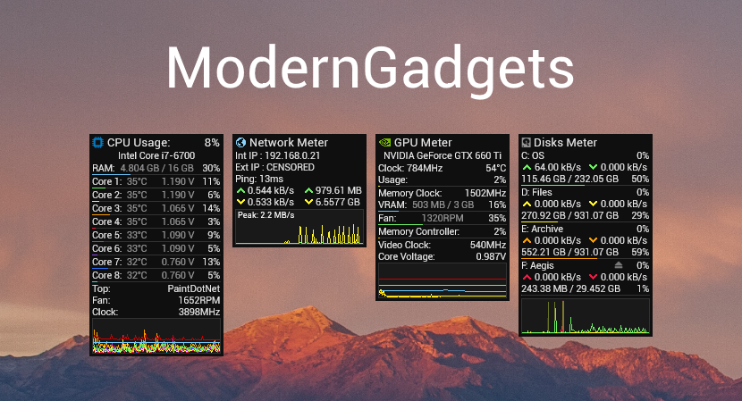

ModernGadgets is a modernized recreation of the most popular AddGadgets.com system monitoring gadgets, built on the Rainmeter platform. Included are CPU Meter, Network Meter, GPU Meter, and Disks Meter. More gadgets will be added over time.

ModernGadgets is released on the Rainmeter platform under a Creative Commons BY-NC-SA 3.0 license. The source code is made available on GitHub under an MIT License.

## Requirements
Rainmeter 4.1 or newer: https://www.rainmeter.net

HWiNFO (not required for all features): https://www.hwinfo.com

.NET Framework 4.5 or newer

## Installation Instructions
ModernGadgets official releases are packaged using the Rainmeter skin installer. After downloading the .RMSKIN package, make sure you have Rainmeter installed, then simply open the file to install the suite. Make certain that you keep the "load included skins" box checked. Once installed, you will be presented with the gadget manager, from which you can load the gadgets you want.

## Repository Information
### Bug Reports
First and foremost, please read through the setup tutorial. You may find that something you thought was broken just needs to be configured properly (e.g. HWiNFO not communicating with Rainmeter). If the problem is not addressed in the setup tutorial, please SEARCH FOR the issue under the issues section of the repository. If the issue has not already been reported, feel free to make a new one. Be clear and use proper language both in the title and the description of any issues you create.

### Contributions
Contributions are welcome! If you would like to add your own code, feel free to fork the repository and submit a pull request when ready. A list of things to be done will be kept in the issues section of the repository.

### Suggestions
Rather than giving ideas or suggestions, please try to implement the functionality yourself. Rainmeter is a very open and community-centric platform, and it's fairly easy to learn, so dig in! The [Rainmeter Forums](https://forum.rainmeter.net) and [Rainmeter Documentation](https://docs.rainmeter.net) are good places to get started and recieve assistance.

## Credits
Designed and programmed by Caleb Heuer (raiguard).

Backend code based on "Gadgets" by SilverAzide.

"Roboto" font from Google Fonts, under the Apache License, version 2.0.

### Additional Attributions

SilverAzide - ActiveNet plugin, NetMonitor utility, fixed precision format script

stangowner - HWiNFO Plugin, HWiNFO Shared Memory Viewer

jsmorley - RainRGB, Rainmeter

balala - Help with fixing Disks Meter's dynamic height adjustment

smurfier - ReadINI function